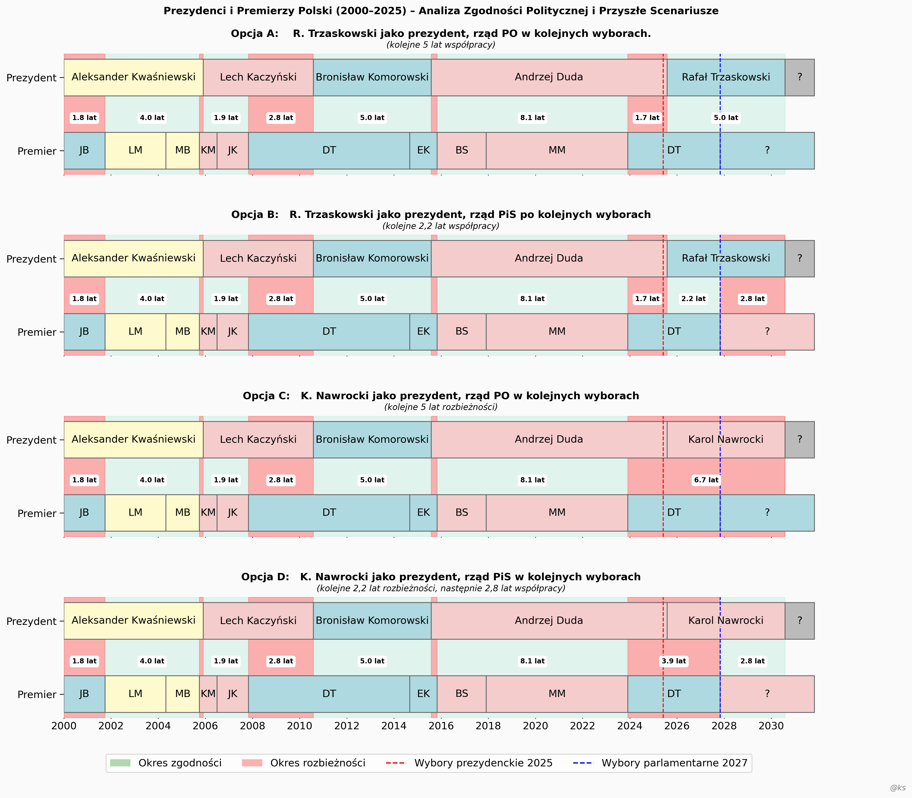

Wykres przedstawia wszystkich prezydentów i premierów od 2000 roku aż do 2032 (predykcja).
Dzięki temu bardzo dobrze widać okresy w krórych prezydent i premier reprezentowali zbierzne opcje polityczne.

Wykresy przedstawiają cztery kolejne opcje w dwóch następnych wyborach:

Opcja A:   R. Trzaskowski jako prezydent, rząd PO w kolejnych wyborach
Opcja B:   R. Trzaskowski jako prezydent, rząd PiS po kolejnych wyborach
Opcja C:   K. Nawrocki jako prezydent, rząd PO w kolejnych wyborach
Opcja D:   K. Nawrocki jako prezydent, rząd PiS w kolejnych wyborach

Opcja A jest podobna do roku 2011 gdy prezydentem był Bronisław Komorowski.
Obcja B jest podobna do roku 2006 gdy prezydentem był Lech Kaczyński. 
Opcja C nie miała jeszcze miejsca, ale prawie 7 lat klinczy dobrze nie wróży.
Opcja D jest podobna do roku 2000 gdy prezydentem był Aleksander Kwaśniewski. Ale wtedy władzę przejęła lewica.

